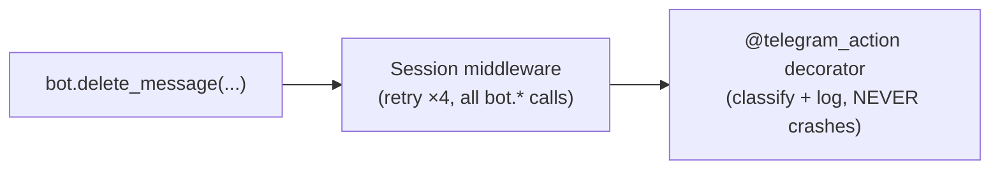

# CLAUDE.md

This file provides guidance to Claude Code (claude.ai/code) when working with code in this repository.

## Project Overview

**ai-antispam** — Telegram AI spam blocker bot using LLMs for classification.

- Bot: [@ai_spam_blocker_bot](https://t.me/ai_spam_blocker_bot)
- Channel: [@ai_antispam](https://t.me/ai_antispam)
- Site: [ai-antispam.ru](https://ai-antispam.ru)

## Commands

```bash
# Install dependencies
uv sync

# Run tests
pytest tests/ -v

# Lint & format
ruff check src/ tests/
ruff format src/ tests/

# Type check
uvx ty check src

# Run locally (from project dir)
python -m src.app.main
```

## Architecture

```
src/app/
├── main.py           # Entry point
├── bot_commands.py   # Telegram bot commands
├── handlers/         # Message/event handlers
├── spam/             # Spam detection logic
├── database/          # DB queries and models
├── background_jobs/  # Async tasks
├── common/           # Shared utilities
├── types.py          # Pydantic types
├── i18n.py           # Internationalization
└── locales/          # Translation files
```

## Database

**DBHub MCP** connected to PostgreSQL at `144.31.188.163:5432/ai_spam_bot`.

## MCP Servers

- **DBHub**: PostgreSQL database access
- **Context7**: API documentation
- **logfire**: Logs and metrics
- **MiniMax**: Coding plan MCP
- **telegram**: Telegram bot integration

## Memory Bank

At start of dialog, read relevant memory-bank files:
- `memory-bank/activeContext.md` — current system state
- `memory-bank/confirmedSpamExamples.md` — labeled spam examples
- `memory-bank/progress.md` — recent work log
- `memory-bank/techContext.md` — technical details
- `memory-bank/opsPlaybook.md` — deploy/broadcast/migration pitfalls for agents

## Docker

**Image:** `ghcr.io/alexeyleshchenko/ai-antispam` — **184MB**. Legacy pulls from `ghcr.io/leshchenko1979/ai-antispam` until the apps compose switchover.

- Base: `python:3.14-alpine` (Alpine Linux, ~5MB base vs ~25MB Debian)
- `pydantic-ai-slim[openai,logfire]` instead of full `pydantic-ai`
- Builder stage: no system deps (pre-built wheels only)
- Runner stage: `apk add --no-cache curl` for healthcheck only

## Key Patterns

- Spam classification uses LLM with confidence thresholds (default 90%)
- Admin can set auto-delete mode or notification-only mode
- Billing via Telegram Stars
- Personal spam examples per admin for fine-tuning

## Error handling (Telegram API)

Every `bot.*` call (deleteMessage, banChatMember, sendMessage, …) flows
through **two layers** — never add retry or try/except directly at the call
site:



**1. Session middleware** (`src/app/common/bot.py` → `setup_session_retry(bot)`)

Applied once on the session, covers **all** `bot.*` API calls automatically.
Handles `TelegramNetworkError`, `asyncio.TimeoutError`, `aiohttp.ClientError`.
Uses `_compute_retry_delay` (cap 15 s/sleep, 45 s total budget).

**2. `@telegram_action` decorator** (`src/app/handlers/handle_spam.py`)

```python
from .handle_spam import telegram_action

@telegram_action("ban user", extra_checks=(is_message_not_found_error,))
async def _ban() -> None:
    await bot.ban_chat_member(chat_id, user_id)
    ban_applied = True
```

Catches `(TelegramBadRequest, TelegramForbiddenError)` → classify
(group_inaccessible, message-not-found, permission-error) + structured log.
Catches `Exception` → warning log. **Never crashes.**

Rules for future edits:

- **Do NOT add `@retry_on_network_error` on `bot.*` calls.** The middleware
  already retries. Adding a second decorator duplicates retries and complicates
  debugging.
- **Any new Telegram-moderator action (delete, ban, unban, restrict) MUST go
  through `@telegram_action`.** The MG incident (2026-08-21) was caused by a
  bare try/except block that lacked `except Exception` — a `TimeoutError`
  escaping from `bot.delete_message` skipped the subsequent ban call.
- **`@retry_on_network_error` still applies to non-`bot.*` HTTP calls:**
  `mcp_client.py` (aiohttp POST), `mtproto_client.py` (aiohttp POST),
  `broadcast_updates.py` (standalone `Bot()` session). Do NOT remove it from
  those files.
- **When `check_admin_delete_preferences` returns `False` unexpectedly, check
  the diagnostic `logger.warning()` first.** It logs WHY (admin not found, opted
  out, empty admin_ids), saving a round-trip to the database.

## Chat-topic signal (`/scan`)

Every monitored chat can carry a **topic profile** (`groups.topic_description` /
`topic_description_short` / `topic_updated_at`) derived from recent messages.
It feeds the classifier as an extra signal (`chat_topic` request key +
`## CHAT TOPIC CONTEXT` prompt section).

- **Phase 1 is manual-only:** the admin runs `/scan` in the bot DM; picker flow
  `scan_chat:<id>` in `callback_handlers.py`. **No automatic scan/backfill/refresh
  yet** — that is Phase 2 (deferred in `docs/design-chat-topics.md`).
- Scan service: `src/app/spam/chat_topics.py` (`scan_chat_topics(group_id)`).
- Derivation agent: `agents.py` `derive_topic_summary()` (gateway → OpenRouter,
  never raises — `None` on total failure; caller applies title fallback).
- Fallback semantics: first-scan failure/empty sample → chat title; re-scan
  failure → keep existing description; empty re-scan → keep.
- Off-topic is an **elevated** signal, never a sole reason (Trojan Horse guard).
- Sample caps (config `spam:`): `topic_scan_limit` (fetch, 100),
  `topic_max_message_chars` (500/msg), `topic_max_total_chars` (16K total ≈ 4K
  tokens — the derivation call provably fits any rotation model).
- A `chat_topic` older than the refresh horizon is a stale heuristic — surfaced
  on `/stats` as `<short> · Nd old`.

## Logging

**Logging conventions are codified — read `docs/LOGGING.md` before writing or
touching any log line.** Core rules: every side-effect logs its outcome (success
or failure) with chat/admin context; correlation ids in plain-text log lines;
`@logfire.instrument(extract_args=True, record_return=True)` on flow-boundary
functions; absence of a log line is never evidence of absence of execution.
